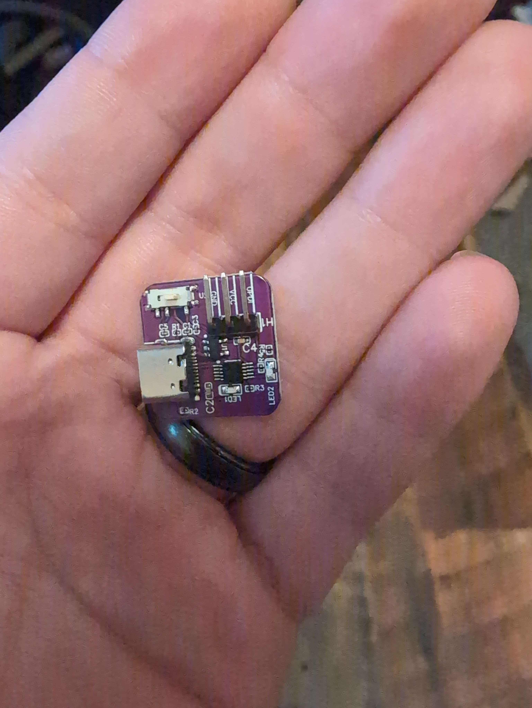
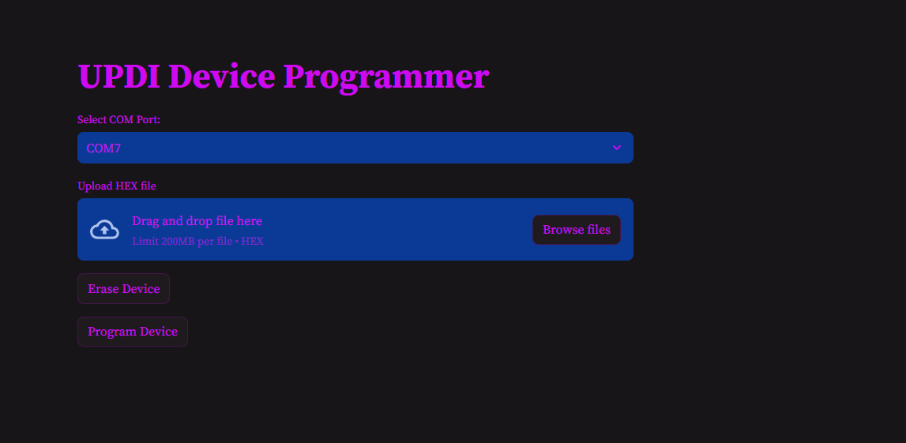

# UPDI Programmer Web App



This web app simplifies programming UPDI devices. You are welcome to use an compatible UPDI device but i have created one myself.

While still under development, it currently supports pushing firmware to the ATtiny412 if you provide a hex file compiled from the Arduino IDE.

I do know that there is good support for this device on Arduino but i like building my own tools and this feels like a little easier for on the go programming if access to arduino tools is limited 


## Build WEB app Locally

1. **Clone this repository**

```
git clone https://github.com/alee97422/UPDI_programmer.git

```

2. **Install Dependencies**

Provide details or commands for installing necessary dependencies here.

3. **Run Web App**

```

streamlit run app.py

```

This should open up a tab in your default browser but if not it will always output a link in your terminal console to access the web app 

## USAGE

### Step 1: Connect SAO to the UPDI Programmer

- Connect the SAO pinout 6-pin connector as follows:
- **Top left pin**: Not connected
- **Bottom left pin**: Not connected
- **Top middle pin**: Not connected
- **Bottom middle pin**: Connect wire to the UPDI labeled pin header on the programmer
- **Top right pin**: VCC pin
- **Bottom right pin**: GND pin

- Connect the programmer to the PC using a USB-C data cable.

### Step 2: Programming the Device



- In the WEB app please select COM port associated with the UPDI programmer
- UPLOAD HEX FILE(this was included in the repo but you are welcome to build your own with Arduino )
- ERASE DEVICE  --IMPORTANT--
- PROGRAM DEVICE 


